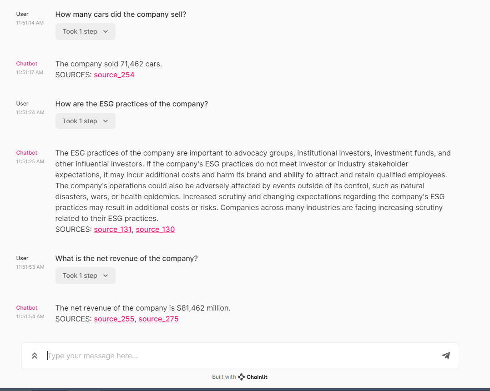

# Document QA with LangChain

A proof of concept that lets users upload a document (in text or PDF format) and then ask questions about its content. Utilizes the `langchain` library to create a retrieval-based question answering system, leveraging embeddings from OpenAI and storing vectors in `ChromaDB`.

## Libraries and Modules Used

### Main Libraries

- `chainlit`: For interactive scripting.
- `langchain`: Core library to set up the retrieval-based QA system.
  
### Modules

- `document_loaders`: Handles different types of document inputs (e.g. PDF, Text).
- `text_splitter`: Splits larger documents into smaller manageable chunks.
- `embeddings`: Represents the text in vector form using OpenAI embeddings.
- `vectorstores`: Uses `Chroma` for storing vectors.
- `chains`: Defines the retrieval question answering process.
- `chat_models`: Uses OpenAI for chat-based interactions.

## Features

 

- Upload a PDF or text document.
- Splits the document into smaller chunks and encodes them into vector space.
- Answers questions about the document using OpenAI.
- Retrieves source of the answer from the original document.

## Prerequisites

- Python 3.x
- `langchain` library
- OpenAI API key
- `ChromaDB` for vector store

## Environment Variables

- `OPENAI-API-KEY`: Your OpenAI API key.

## How to Use

## Setup and Installation ⚙️

1. **Clone the repository:**

   ```
   git clone https://github.com/efeakm/LLM-VectorDB.git
   cd LLM-VectorDB
   ```

2. **Set up a virtual environment (optional but recommended):**

   ```
   python3 -m venv venv
   source venv/bin/activate  # For Windows, use `venv\Scripts\activate`
   ```

3. **Install the required packages:**

   ```
   pip install -r requirements.txt
   ```

4. **Run the Chainlit app:**

   ```
   chainlit run app.py
   ```

   This will open a new tab in your web browser with the app running.

5. **Use the app:**  
- You will be prompted to upload a PDF or text document.
- Once the document is uploaded and processed, you can start asking questions.
- The system will return answers along with references (sources) from the uploaded document.

## Future Enhancements

- Support for more document types.
- Enhanced user experience with better error handling.
- Scalability improvements for larger documents.

## Contributors

Efeakm
